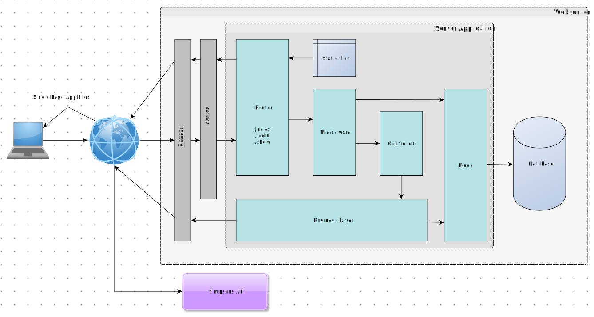

# Simpsons Quote App

## Project description
This local demo application provides an HTTP API with two methods: `login` and `show`. The `login` method is unrestricted, the `show` method requires authentication. A single page application is assumed as client.

An API client can send a valid pair of username (email address) and password in the body of a HTTP POST request to the `login` method and retrieve a token in the body of the response in JSON format.

An API client can use this token as HTTP Bearer token in a HTTP GET request to the `show` method and retrieve five Simpsons quotes from the Simpsons API https://thesimpsonsquoteapi.glitch.me. For the first of all requests to the `show` method the application fetches five Simpsons quotes from the Simpsons API, saves them to the database and sends them to the client. For all following requests to the `show` method the application fetches one new Simpsons quote, adds it to the database, removes the oldest one from the database and returns the five remaining Simpsons quotes (the one fetched plus four of the previous ones). The application logic ensures that there will be exactly five Simpsons quotes saved in the database after a successful request to the `show` method.

## Setup
This application is based on Laravel 12: https://laravel.com/docs. This application is intended for local usage only. It uses Laravels `sail` tool for setup and running (https://laravel.com/docs/12.x/).

Laravels Sanctum package is also included: https://laravel.com/docs/12.x/sanctum.

Developed and tested on MacOS 15.3.1 (Intel) with Docker Desktop 4.39.0, PHP 8.4.4, composer 2.8.6.

### Prerequisites
* PHP >= 8.2, <= 8.4 (Laravel 12 restriction)
* Composer
* Docker
* Docker Compose

### Installation and run

    git clone https://github.com/dahomanan/simpsons-quote-app.git
    cd simpsons-quote-app
    cp .env.dev .env
    composer install
    vendor/bin/sail up
    vendor/bin/sail artisan migrate
    vendor/bin/sail artisan db:seed
    vendor/bin/sail artisan test

## Usage
Once the Docker compose setup is and running requests can be sent to the API.

### Login
* Endpoint: http://localhost/api/simpsons-quotes/login
* HTTP POST
* Body: POST data fields `email` and `password`. Use the values from the user created in the database seeding:

  * email: test@example.com
  * password: password=strenggeheim

* Accept header for `application/json` type
* Example with cURL

        curl -H 'Accept: application/json' -X POST -d 'email=test@example.com&password=strenggeheim' -i http://localhost/api/simpsons-quotes/login

### Show
* Endpoint: http://localhost/api/simpsons-quotes/show
* HTTP GET
* Accept header for `application/json` type
* Authorization header with Bearer token
* Example with cURL

        curl -H 'Accept: application/json' -H 'Authorization: Bearer <token>' -X GET -i http://localhost/api/simpsons-quotes/show

## Application architecture

A client sends an HTTP request to the API endpoint URL, request should be HTTPS encrypted.

The webserver receives the request and forwards it to PHP which invokes the Laravel PHP application.

The Simpsons Quotes App is structured in the MVC pattern.

In the Laravel router middleware and controllers are bound to URL paths and HTTP methods. Laravel middleware is used to validate the Bearer token on protected routes (Laravel Sanctum). See `./routes/api.php`.

In the controller the HTTP request is "offloaded". Incoming parameters are validated and passed to the business logic. See namespace `App\Http\Controllers`. 

Controllers are also responsible for rendering the HTTP response using views. This application takes advantage of Laravels automatic transformation of PHP arrays to JSON: The controllers return PHP arrays with the result data, Laravel will send it as JSON to the client.

The business logic does all the "heavy" work and returns the results to the controllers. The business logic uses the Laravel Eloquent models to interact with the database and utilizes other components from the framework to accomplish its tasks. It also fetches new Simpsons quotes from the Simpsons API. See namespace `App\SimpsonsQuotes`.

The Laravel Eloquent models `SimpsonsQuote` and `User` operate on the `simpsons_quotes` and `users` tables in a MySQL database.

## Decisions
This is a local demo application. Some presumptions and decisions have been made, that are *NOT* suited for usage on productive systems.

* No HTTPS encryption implemented, absolutely necessary on PROD
* `APP_DEBUG` is set to true, should be false on PROD to hide exception details
* Laravels ORM is used to work with the database
* There are two possibilities for authentication: Session or token. Token was chosen to keep it simple
* Laravels Sanctum (https://laravel.com/docs/12.x/sanctum) is used for token generation and validation. Custom JWT would have been another possibility.
* Tokens do not expire
* Tokens can not be revoked by user
* One fixed, already registered user
* Email address is used as username since email addresses tend to be more "unique"
* Simple validation of Simpsons API quotes: Check for fields and non-empty strings
* Custom HTTP API in MVC style, no REST API. The `show` method does a lot of things (fetching quotes, saving to / deleting from database, ...) and is more like an operation. But the application can be expanded to an REST API if more resources come up to be managed.
* No logging, only errors/exceptions
* Configuration not used for custom code
* No advanced exception handling. If exception occurs, the request exists. Laravel sends exception information to client.
* Only two tests on route level, one for each method
* No custom interfaces as no different implementations are currently used
* No PHP DocBook comments
* Default Laravel behaviour unchanged: Accept header has to be set to "application/json" to retrieve JSON responses, otherwise HTML is rendered
* Kept default Laravel setup in application (welcome page, example console route, migrations, ...)

## Changes to be discussed
* Implement user registration, e.g. `register` method
* Implement user permissions, e.g. which users are allowed to see/do what?
* If multiple users exist: Should all users operate on the same five quotes in the database or should every user has her/his own quotes?
* Is the application logic save for concurrent user requests to `show` method? Especially to the adding and deleting of newest / oldest quote?
* Is exception handling properly structured? Where to exit and where to continue? What to send to the client (status code, body)?

    * User not found
    * Invalid password
    * No token sent
    * Invalid token sent
    * No connection to Simpsons API (no network, firewall rule etc.)
    * Simpsons API returns other status than 200
    * Data from Simpsons API is invalid
    * Simpsons quotes can not be loaded from database
    * New Simpsons quote can not be saved to database
    * Obsolete Simpsons quotes can not be deleted from database

* Consider rate limiting for API methods to protect the application and the data within
* More tests covering multiple cases (failing requests like above, successful requests). Decision what to test: e2e, integration, unit. Test structure.
* Better class modelling? A lot of "Simpsons" and "Quotes" in there...
* If for some reason the data from the Simpsons API is considered confidential and needs protection:
    
    * HTTPS 
    * Database encryption (at rest / transparent)
    * Application side encryption / end to end encryption (client to server)
    * Concept for securely managing and storing the keys is necessary
    * Performance considerations

* In general when working with ORMs: Check used ORM statements for performance. How many and which queries are ran internally? How much data is loaded? Is all that data actually needed?
* Use plain SQL if performance matters instead of ORM. Consider compatibility of SQL statements if different database systems should be supported. Performance vs. ORM already providing compatibility
* Where to store the token in a single page application: Local storage, memory, cookie? Or use session (Laravel supports this on the same domain/subdomain).
* Token expiration / refresh
* Send username/password as JSON body to `login` method, more Javascript style of single page applications

## LICENSE
MIT license, see LICENSE file
